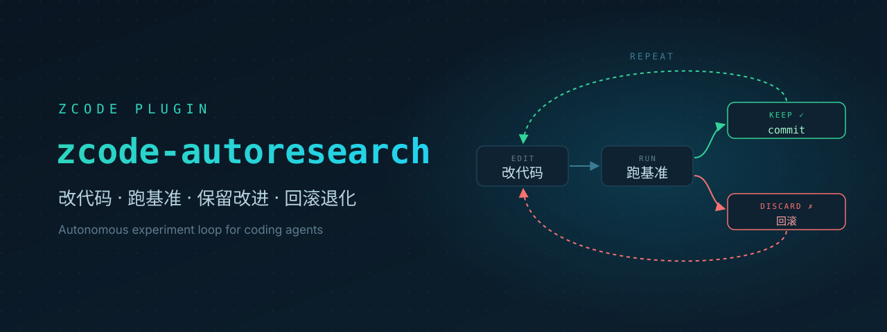

<div align="right">
  <a title="English" href="README.md"></a>
  <a title="简体中文" href="README_CN.md"></a>
</div>

# zcode-autoresearch

[](https://zcode.z.ai)
[](plugin/.zcode-plugin/plugin.json)
[](https://github.com/luochang212/zcode-autoresearch/actions/workflows/ci.yml)
[](LICENSE)
[![zread](https://img.shields.io/badge/%E2%80%8B-zread-0e7490?style=flat-square&logo=data%3Aimage%2Fsvg%2Bxml%3Bbase64%2CPHN2ZyB3aWR0aD0iMTYiIGhlaWdodD0iMTYiIHZpZXdCb3g9IjAgMCAxNiAxNiIgZmlsbD0ibm9uZSIgeG1sbnM9Imh0dHA6Ly93d3cudzMub3JnLzIwMDAvc3ZnIj4KPHBhdGggZD0iTTQuOTYxNTYgMS42MDAxSDIuMjQxNTZDMS44ODgxIDEuNjAwMSAxLjYwMTU2IDEuODg2NjQgMS42MDE1NiAyLjI0MDFWNC45NjAxQzEuNjAxNTYgNS4zMTM1NiAxLjg4ODEgNS42MDAxIDIuMjQxNTYgNS42MDAxSDQuOTYxNTZDNS4zMTUwMiA1LjYwMDEgNS42MDE1NiA1LjMxMzU2IDUuNjAxNTYgNC45NjAxVjIuMjQwMUM1LjYwMTU2IDEuODg2NjQgNS4zMTUwMiAxLjYwMDEgNC45NjE1NiAxLjYwMDFaIiBmaWxsPSIjZmZmIi8%2BCjxwYXRoIGQ9Ik00Ljk2MTU2IDEwLjM5OTlIMi4yNDE1NkMxLjg4ODEgMTAuMzk5OSAxLjYwMTU2IDEwLjY4NjQgMS42MDE1NiAxMS4wMzk5VjEzLjc1OTlDMS42MDE1NiAxNC4xMTM0IDEuODg4MSAxNC4zOTk5IDIuMjQxNTYgMTQuMzk5OUg0Ljk2MTU2QzUuMzE1MDIgMTQuMzk5OSA1LjYwMTU2IDE0LjExMzQgNS42MDE1NiAxMy43NTk5VjExLjAzOTlDNS42MDE1NiAxMC42ODY0IDUuMzE1MDIgMTAuMzk5OSA0Ljk2MTU2IDEwLjM5OTlaIiBmaWxsPSIjZmZmIi8%2BCjxwYXRoIGQ9Ik0xMy43NTg0IDEuNjAwMUgxMS4wMzg0QzEwLjY4NSAxLjYwMDEgMTAuMzk4NCAxLjg4NjY0IDEwLjM5ODQgMi4yNDAxVjQuOTYwMUMxMC4zOTg0IDUuMzEzNTYgMTAuNjg1IDUuNjAwMSAxMS4wMzg0IDUuNjAwMUgxMy43NTg0QzE0LjExMTkgNS42MDAxIDE0LjM5ODQgNS4zMTM1NiAxNC4zOTg0IDQuOTYwMVYyLjI0MDFDMTQuMzk4NCAxLjg4NjY0IDE0LjExMTkgMS42MDAxIDEzLjc1ODQgMS42MDAxWiIgZmlsbD0iI2ZmZiIvPgo8cGF0aCBkPSJNNCAxMkwxMiA0TDQgMTJaIiBmaWxsPSIjZmZmIi8%2BCjxwYXRoIGQ9Ik00IDEyTDEyIDQiIHN0cm9rZT0iI2ZmZiIgc3Ryb2tlLXdpZHRoPSIxLjUiIHN0cm9rZS1saW5lY2FwPSJyb3VuZCIvPgo8L3N2Zz4K&logoColor=ffffff)](https://zread.ai/luochang212/zcode-autoresearch)



一个 ZCode 插件，让 coding agent 在**固定度量**上自主迭代优化：设定目标与机械度量后，agent 逐轮提出假设、改代码、跑基准；改进自动保留并 commit，退化自动回滚，直到收敛。机制参考 [karpathy/autoresearch](https://github.com/karpathy/autoresearch) 和 [pi-autoresearch](https://github.com/davebcn87/pi-autoresearch)。

## ✨ 功能特性

- **自主实验循环**：一次聚焦改动 → 跑基准 → 改进自动 keep 并 commit，退化自动 discard 并回滚，直到收敛或达到迭代上限
- **实测有效**：真实项目上，agent 独立把 js-yaml 解析从 134ms 优化到 32ms（4.2 倍），把质数计算从 695ms 优化到 3ms（230 倍）
- **防作弊护栏**：冻结基准写保护、checks 正确性门禁、账本审计、基准漂移检测、次级度量约束（见下文）
- **迭代钩子**：`.auto/hooks/before.sh` 与 `after.sh` 在每次实验前后自动执行，6 个现成示例（防重复失败、假设反思、学习日志等）复制即用
- **实时面板**：本地 dashboard 通过 SSE 自动刷新，实验过程边跑边看
- **一键收尾**：`/autoresearch:finalize` 把 kept 实验整理成可 PR 的干净分支

## 🚀 快速开始

本仓库本身就是一个插件市场（`marketplace.json` 指向 `plugin/`）。在 ZCode 中：

1. 打开 **Settings → Plugin Management → 添加市场**，指向本仓库，本地目录或 GitHub 地址都可以。
2. 安装并启用 `autoresearch` 插件。
3. 在任意 git 项目里输入：

```
/autoresearch:autoresearch 优化 <目标>，metric 是 <度量>，越低越好
```

之后 agent 会引导完成 setup 并进入循环。

## 😇 护栏：怎么防止 agent 造假

自主循环最大的风险是 agent 为了「跑分」造假。四层结构性护栏，违规即拒收：

| 层                | 防什么                                  | 机制                                                                  |
| ----------------- | --------------------------------------- | --------------------------------------------------------------------- |
| checks 正确性背压 | 输出不对或删功能                        | `.auto/checks.sh` 断言，失败禁 keep                                   |
| 审计不变量        | 账本说谎，假装保留或丢弃                | `log_experiment` 写入前校验：keep 必须真实改进、事件顺序、commit 溯源 |
| 基准漂移检测      | 改基准造假 metric                       | `init_experiment` 记录冻结文件哈希，中途变更即警告                    |
| 次级度量约束      | 用内存或调用数换速度，即 reward hacking | opt-in 的 `constraints: [{name, maxPct}]`，超界禁 keep                |

> [!NOTE]
> **已知边界**（平台限制，如实记录）：zcode 无会话注入 API——无法过夜无人值守，靠 Stop 3 次窗口加用户回车续跑；无 compaction 事件——靠聚合摘要注入保住记忆；无 TUI widget——用浏览器 dashboard 替代。详见 [`docs/research/pi-gap-analysis.md`](docs/research/pi-gap-analysis.md)。

## 📁 仓库结构

```text
.
├── plugin/           # 插件本体：manifest、mcp server、hooks、skills、commands、scripts、tests
├── openspec/         # openspec 规划：specs/ 是主规范，changes/ 是变更记录
├── adr/              # adr-kit 架构决策记录
├── assets/           # README 用图（banner 等）
├── docs/research/    # 研究报告
└── archived/         # 草稿本：外部仓库 clone 和临时资料，不入库
```

## 🙌 如何贡献

我们欢迎任何形式的贡献！

- 🐛 报告 Bug — 发现问题请提交 Issue
- 💡 功能建议 — 有好想法就告诉我们
- 🔧 代码优化 — 欢迎提交 Pull Request

## 📜 License

[MIT](LICENSE)
