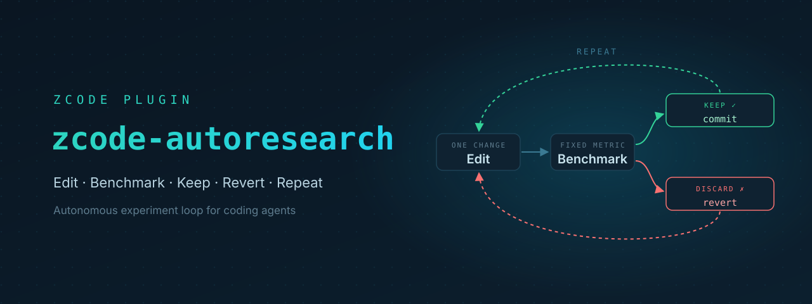

<div align="right">
  <a title="简体中文" href="README.md"></a>
  <a title="English" href="README_en.md"></a>
</div>

<div align="center">

# zcode-autoresearch

[](https://github.com/luochang212/zcode-autoresearch/actions/workflows/ci.yml)
[](LICENSE)
[![zread](https://img.shields.io/badge/%E2%80%8B-zread-0e7490?style=flat-square&logo=data%3Aimage%2Fsvg%2Bxml%3Bbase64%2CPHN2ZyB3aWR0aD0iMTYiIGhlaWdodD0iMTYiIHZpZXdCb3g9IjAgMCAxNiAxNiIgZmlsbD0ibm9uZSIgeG1sbnM9Imh0dHA6Ly93d3cudzMub3JnLzIwMDAvc3ZnIj4KPHBhdGggZD0iTTQuOTYxNTYgMS42MDAxSDIuMjQxNTZDMS44ODgxIDEuNjAwMSAxLjYwMTU2IDEuODg2NjQgMS42MDE1NiAyLjI0MDFWNC45NjAxQzEuNjAxNTYgNS4zMTM1NiAxLjg4ODEgNS42MDAxIDIuMjQxNTYgNS42MDAxSDQuOTYxNTZDNS4zMTUwMiA1LjYwMDEgNS42MDE1NiA1LjMxMzU2IDUuNjAxNTYgNC45NjAxVjIuMjQwMUM1LjYwMTU2IDEuODg2NjQgNS4zMTUwMiAxLjYwMDEgNC45NjE1NiAxLjYwMDFaIiBmaWxsPSIjZmZmIi8%2BCjxwYXRoIGQ9Ik00Ljk2MTU2IDEwLjM5OTlIMi4yNDE1NkMxLjg4ODEgMTAuMzk5OSAxLjYwMTU2IDEwLjY4NjQgMS42MDE1NiAxMS4wMzk5VjEzLjc1OTlDMS42MDE1NiAxNC4xMTM0IDEuODg4MSAxNC4zOTk5IDIuMjQxNTYgMTQuMzk5OUg0Ljk2MTU2QzUuMzE1MDIgMTQuMzk5OSA1LjYwMTU2IDE0LjExMzQgNS42MDE1NiAxMy43NTk5VjExLjAzOTlDNS42MDE1NiAxMC42ODY0IDUuMzE1MDIgMTAuMzk5OSA0Ljk2MTU2IDEwLjM5OTlaIiBmaWxsPSIjZmZmIi8%2BCjxwYXRoIGQ9Ik0xMy43NTg0IDEuNjAwMUgxMS4wMzg0QzEwLjY4NSAxLjYwMDEgMTAuMzk4NCAxLjg4NjY0IDEwLjM5ODQgMi4yNDAxVjQuOTYwMUMxMC4zOTg0IDUuMzEzNTYgMTAuNjg1IDUuNjAwMSAxMS4wMzg0IDUuNjAwMUgxMy43NTg0QzE0LjExMTkgNS42MDAxIDE0LjM5ODQgNS4zMTM1NiAxNC4zOTg0IDQuOTYwMVYyLjI0MDFDMTQuMzk4NCAxLjg4NjY0IDE0LjExMTkgNS42MDAxIDEzLjc1ODQgMS42MDAxWiIgZmlsbD0iI2ZmZiIvPgo8cGF0aCBkPSJNNCAxMkwxMiA0TDQgMTJaIiBmaWxsPSIjZmZmIi8%2BCjxwYXRoIGQ9Ik00IDEyTDEyIDQiIHN0cm9rZT0iI2ZmZiIgc3Ryb2tlLXdpZHRoPSIxLjUiIHN0cm9rZS1saW5lY2FwPSJyb3VuZCIvPgo8L3N2Zz4K&logoColor=ffffff)](https://zread.ai/luochang212/zcode-autoresearch)



_Change code, run the benchmark, keep improvements, roll back regressions, repeat._

</div>

A ZCode plugin that lets a coding agent iterate autonomously on a **fixed metric**: once you set a goal and a mechanical metric, the agent proposes hypotheses, modifies code, and runs the benchmark round by round. Improvements are kept and committed automatically; regressions are rolled back automatically — until convergence. The mechanism is inspired by [karpathy/autoresearch](https://github.com/karpathy/autoresearch) and [pi-autoresearch](https://github.com/davebcn87/pi-autoresearch).

## ✨ Features

- **Autonomous experiment loop**: one focused change per round → run the benchmark → improvements are auto-kept and committed, regressions auto-discarded and rolled back, until convergence or the iteration limit
- **Proven in practice**: on real projects, the agent independently optimized js-yaml parsing from 134ms to 32ms (4.2x), and prime-number computation from 695ms to 3ms (230x)
- **Anti-cheating guardrails**: frozen-benchmark write protection, correctness-gate checks, ledger auditing, benchmark drift detection, secondary metric constraints (see below)
- **Iteration hooks**: `.auto/hooks/before.sh` and `after.sh` run automatically around each experiment, with 6 ready-made examples (repeat-failure prevention, hypothesis reflection, learning logs, and more) you can copy and use
- **Live dashboard**: a local dashboard auto-refreshes via SSE — watch experiments as they run
- **One-command wrap-up**: `/autoresearch:finalize` turns kept experiments into a clean, PR-ready branch

## 🚀 Quick Start

This repository is itself a plugin marketplace (`marketplace.json` points to `plugin/`). In ZCode:

1. Open **Settings → Plugin Management → Add Marketplace** and point it to this repo — a local directory or the GitHub URL both work.
2. Install and enable the `autoresearch` plugin.
3. In any git project, type:

```
/autoresearch:autoresearch optimize <goal>, metric is <metric>, lower is better
```

The agent will then guide you through setup and enter the loop.

## 😇 Guardrails: How the Agent Is Kept Honest

The biggest risk of an autonomous loop is the agent faking results to "score points". Four structural guardrails reject any violation:

| Layer                        | What it prevents                                        | Mechanism                                                                                                      |
| ---------------------------- | ------------------------------------------------------- | -------------------------------------------------------------------------------------------------------------- |
| Correctness backpressure     | Wrong output or deleted functionality                   | Assertions in `.auto/checks.sh`; a failure blocks keep                                                         |
| Audit invariants             | A lying ledger — faked keeps or discards                | Validated before `log_experiment` writes: keeps must be real improvements, event ordering, commit traceability |
| Benchmark drift detection    | Modifying the benchmark to fake the metric              | `init_experiment` records hashes of frozen files; any mid-run change triggers a warning                        |
| Secondary metric constraints | Trading memory or call count for speed — reward hacking | Opt-in `constraints: [{name, maxPct}]`; exceeding the bound blocks keep                                        |

> [!NOTE]
> **Known limits** (platform constraints, recorded honestly): zcode has no session-injection API — no unattended overnight runs; continuation relies on a 3-time Stop window plus the user pressing Enter. No compaction event — memory is preserved via aggregated-summary injection. No TUI widget — replaced by a browser dashboard. See [`docs/research/pi-gap-analysis.md`](docs/research/pi-gap-analysis.md) for details.

## 📁 Repository Structure

```text
.
├── plugin/           # The plugin itself: manifest, mcp server, hooks, skills, commands, scripts, tests
├── openspec/         # openspec planning: specs/ holds the main specs, changes/ holds change records
├── adr/              # adr-kit architecture decision records
├── assets/           # README images (banner, etc.)
├── docs/research/    # Research reports
└── archived/         # Scratchpad: clones of external repos and temporary material, not committed
```

## 🙌 Contributing

Contributions of any kind are welcome!

- 🐛 Report bugs — open an Issue when you find a problem
- 💡 Suggest features — tell us your ideas
- 🔧 Improve the code — Pull Requests are welcome

## 📜 License

[MIT](LICENSE)
